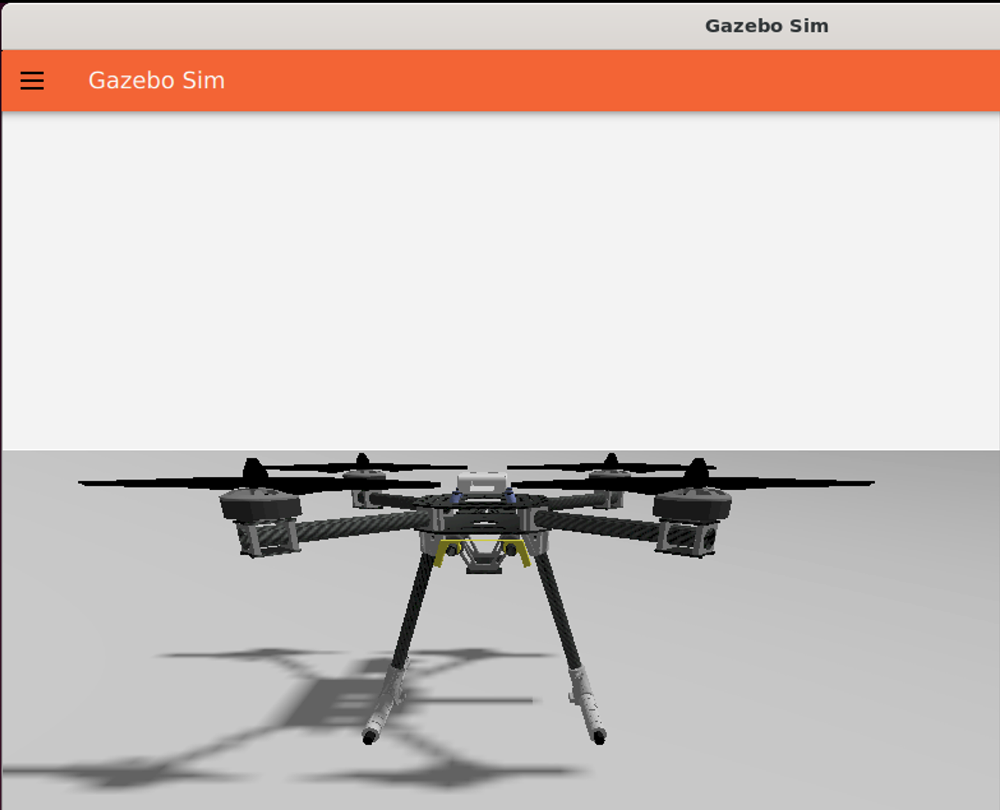
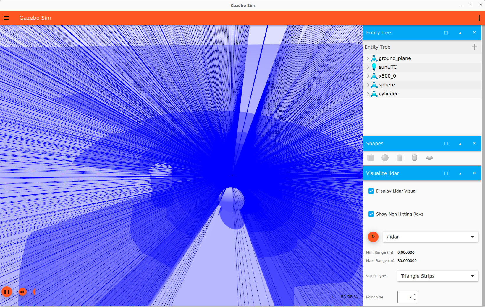
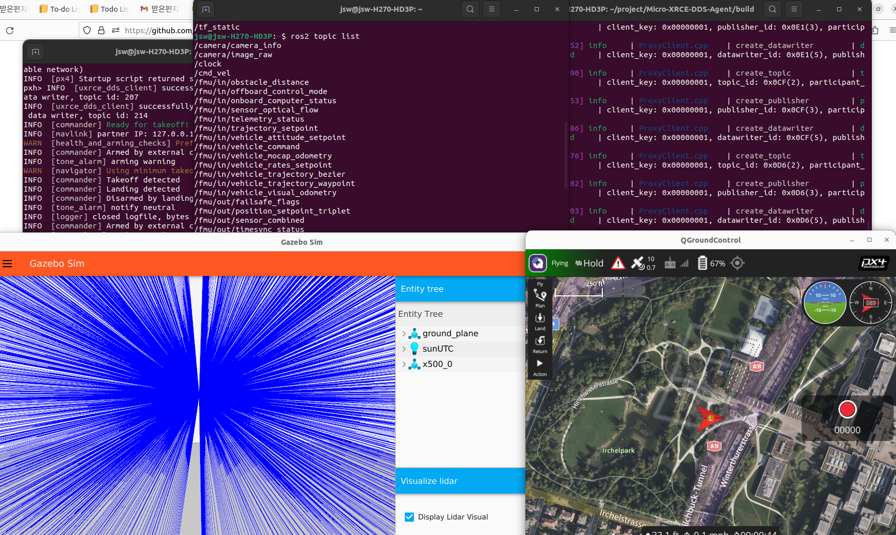

# AutonomousFlight
Deep Reinforcement Based Autonomous Flight

# Features (in progress )
## Phase 0
- [x] Utilized the latest versions of Gazebo (Ignition) Simulator (Gazebo Garden), PX4 (v1.14) on Ubuntu 22.04
- [x] Support ROS2(Humble) based PX4 offboard control
## Phase 1
- [x] Implement Lidar to X500 model
- [ ] Implement advanced Deep Reinforcement Learning (DRL) for local navigation
## Phase 2 
- [ ] Implement SLAM 
- [ ] Implement Global Path Planning 


# Setup 

## PX4 setup
Use the ubuntu.sh script in PX4 repo will install PX4&Gazebo Garden on Ubuntu 22.04. 
[https://docs.px4.io/main/en/dev_setup/dev_env_linux_ubuntu.html](https://docs.px4.io/main/en/dev_setup/dev_env_linux_ubuntu.html)

## ROS2 
Install ROS2 Humble.
[https://docs.ros.org/en/humble/Installation/Ubuntu-Install-Debians.html](https://docs.ros.org/en/humble/Installation/Ubuntu-Install-Debians.html)

Source in the bash shell
```
source /opt/ros/humble/setup.bash
```
### Gazebo - ROS2 Configuration

Check the "Using a specific and unsupported Gazebo version with ROS 2" in the following link [https://gazebosim.org/docs/garden/ros_installation](https://gazebosim.org/docs/garden/ros_installation)
-> some command should be modified,follow the instrutions below. 

- Installing rosdep rules to resolve Gazebo Garden libraries
```
sudo bash -c 'wget https://raw.githubusercontent.com/osrf/osrf-rosdep/master/gz/00-gazebo.list -O /etc/ros/rosdep/sources.list.d/00-gazebo.list'
rosdep update
<!-- check that resolve works --> 
rosdep resolve gz-garden
```
- Installing (ros_gz packages)[https://github.com/gazebosim/ros_gz/tree/humble] which includes ros_gz_bridge

  Create a colcon workspace:
  ```
  export GZ_VERSION=garden
  <!-- Setup the workspace -->
  mkdir -p ~/ws/src
  cd ~/ws/src
  ```
  Install dependencies (this may also install Gazebo):
  ```
  cd ~/ws
  rosdep install -r --from-paths src -i -y --rosdistro humble
  ```
  Build the workspace:
  ```
  <!-- Source ROS distro's setup.bash -->
  source /opt/ros/humble/setup.bash

  <!-- Build and install into workspace -->
  cd ~/ws
  colcon build

  <!-- Download needed software -->
  git clone https://github.com/gazebosim/ros_gz.git -b humble
  ```

  Try this example & check supported msgs after installation from [https://gazebosim.org/docs/garden/ros2_integration](https://gazebosim.org/docs/garden/ros2_integration)
  You need to source to use ros_gz_bridge
  ```
  source ~/ws/install/setup.bash
  ```

### PX4 - ROS2 Configuration

Setup Micro XRCE-DDS Agent & Client from [https://docs.px4.io/main/en/ros/ros2_comm.html](https://docs.px4.io/main/en/ros/ros2_comm.html)


## QGroundControl

Download QGC from [http://qgroundcontrol.com/](http://qgroundcontrol.com/)

# Progress

## Init
```
make px4_sitl gz_x500
```



## Implemented Lidar sensor : [modified model](models/x500-lidar.sdf)


## Implemented ROS2


## Running offboard example
  
- Run MicroXRCEAgent
```
MicroXRCEAgent udp4 -p 8888
```
- Run QGC & TakeOff & change it to Offboard Control mode

- Install Px4_ros_com & px4_mgs, and run offboard example
```
mkdir example_ws
cd example_ws
mkdir src
git clone https://github.com/PX4/px4_msgs.git
git clone https://github.com/PX4/px4_ros_com.git src/px4_ros_com
git clone https://github.com/Jaeyoung-Lim/px4-offboard.git src/px4-offboard
colcon build
source ../example_ws/install/setup.bash
ros2 topic echo /fmu/out/vehicle_status
ros2 launch px4_offboard offboard_position_control.launch.py
```
- demo video
[](https://www.youtube.com/watch?v=KwZc0zg-js4)
